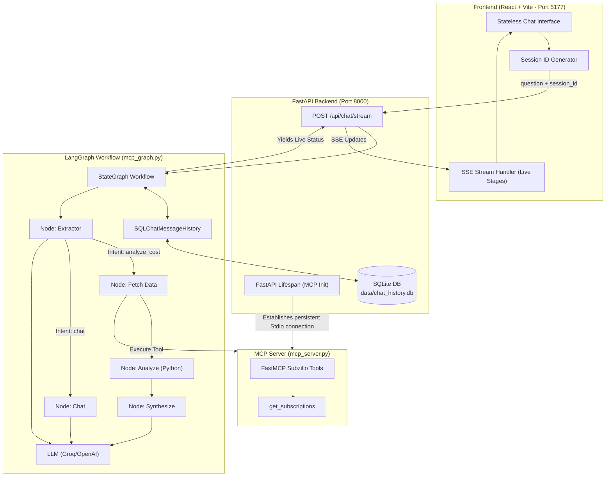
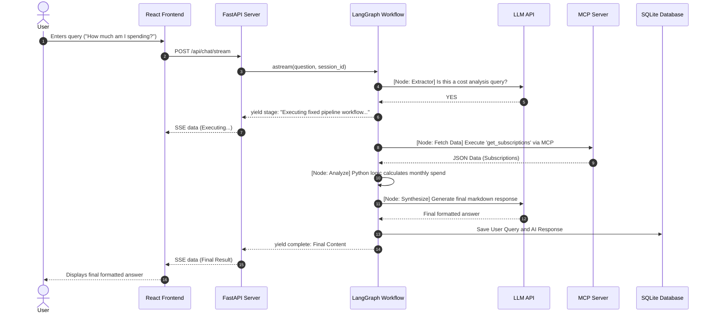

# System Architecture: Demo 6b - Multi-Step Workflow Chatbot

An end-to-end architecture specification for Demo 6b, demonstrating how an AI Agent leverages a deterministic LangGraph Workflow and the Model Context Protocol (MCP) to extract intent, fetch subscription data, analyze it in Python, and synthesize a final response.

---

## 🏛️ High-Level System Architecture

---

## 🔄 End-to-End Query Lifecycle

---

## 🧩 Core Architectural Paradigm Shifts

### 1. Deterministic Multi-Step Workflow
Unlike agents that autonomously decide which tool to call in a loop, this architecture enforces a strict pipeline (`extractor` -> `fetch_data` -> `analyze` -> `synthesize`). This provides better reliability for known enterprise use cases where the steps to fulfill a request are well-defined.

### 2. Hybrid LLM + Code Analysis
The workflow intentionally separates data retrieval from analysis. Instead of giving raw JSON to the LLM to do math (which can hallucinate), the `analyze` node uses standard Python to calculate accurate monthly totals, and then passes the pre-calculated report to the `synthesize` node for formatting.

### 3. MCP Tool Integration in specific nodes
The MCP Client session is initialized at the FastAPI lifecycle level and passed to the LangGraph workflow. The `fetch_data` node directly accesses the MCP session to invoke tools without exposing them to the LLM's autonomous function calling, ensuring tools are only called when the pipeline dictates.
