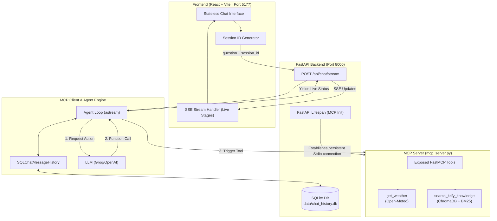
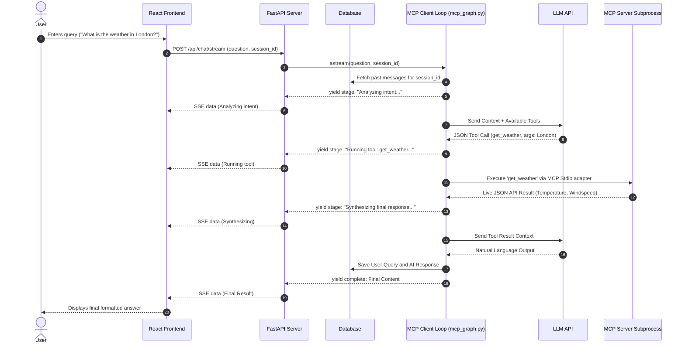

# System Architecture: Demo 5 - Single-Step API-Enabled MCP Agent

An end-to-end architecture specification for Demo 5, demonstrating how an AI Agent leverages the Model Context Protocol (MCP) to autonomously execute tools (live APIs and RAG) with a stateless frontend and a stateful SQLite database backend.

---

## 🏛️ High-Level System Architecture

---

## 🔄 End-to-End Query Lifecycle

---

## 🧩 Core Architectural Paradigm Shifts (From Demo 4)

### 1. The MCP Decoupling
In previous architectures, the tools (like RAG and SQL) were tightly coupled into the LangGraph state execution pipeline. In Demo 5, **the AI logic is fully decoupled from the tool execution via the Model Context Protocol (MCP)**.
- `mcp_server.py` hosts the tools securely in an isolated environment.
- `mcp_graph.py` acts strictly as the **Client Brain**, reading the tools over standard IO, attaching them to the LLM via `bind_tools`, and telling the server when to execute them.

### 2. Stateless UI + Database Memory
Instead of the frontend managing a heavy `history` array, the frontend is completely stateless.
- The UI generates a lightweight `session_id`.
- The backend intercepts this ID and leverages `SQLChatMessageHistory` to inject the historical conversational thread from an SQLite Database into the LLM context.
- This mirrors an enterprise SaaS application.

### 3. Asynchronous Live Streaming (`astream`)
Instead of hiding the execution pipeline behind a monolithic blocking request, the Agent Loop acts as an asynchronous python generator (`yield`). 
As the agent analyzes intent, executes tools, and synthesizes data, those granular status milestones are pushed instantly to the user's screen using Server-Sent Events (SSE).
