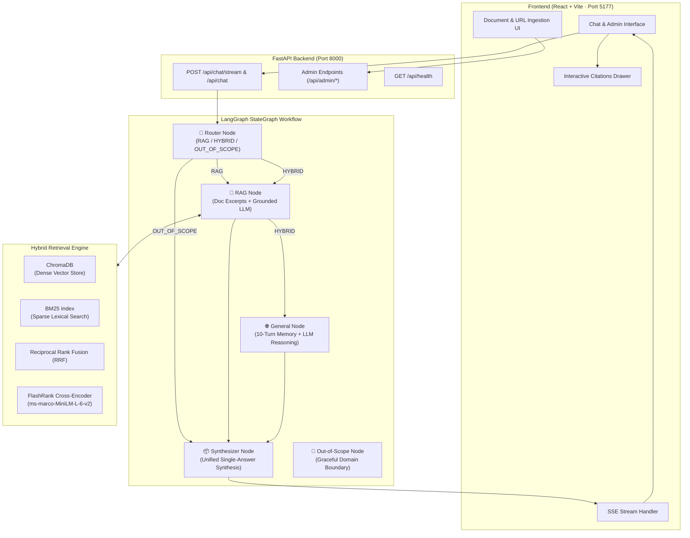
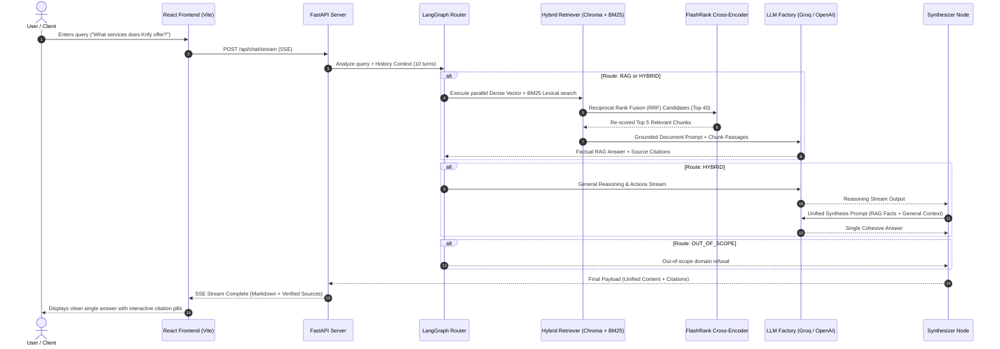
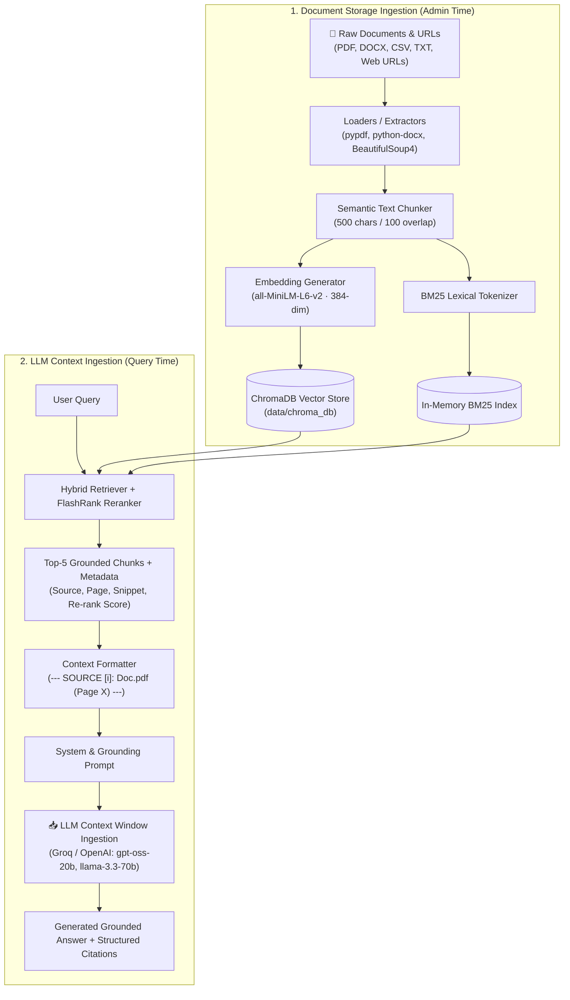
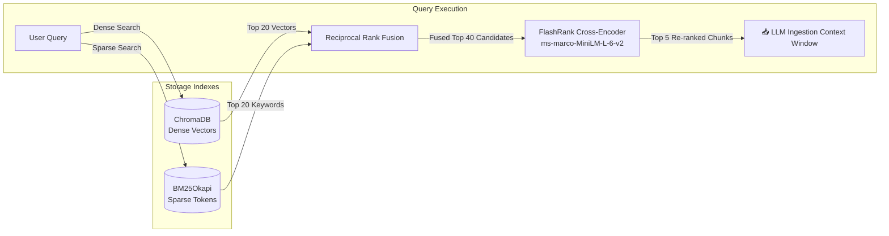

# System Architecture: Demo 4 - Hybrid Enterprise Knowledge AI

An end-to-end architecture specification for the standalone Enterprise Hybrid AI Knowledge Assistant, orchestrating Private Knowledge Base Retrieval (RAG), General Intelligence & Reasoning (LLM), and LangGraph StateGraph Workflow.

---

## 🏛️ High-Level System Architecture



---

## 🔄 End-to-End Query Lifecycle



---

## 🧩 Core Architectural Components

### 1. LangGraph StateGraph Execution Pipeline

The execution flow is structured as a directed graph maintaining the shared `AgentState`:

```
                    ┌─────────────┐
                    │    START    │
                    └──────┬──────┘
                           │
                    ┌──────▼──────┐
                    │   router    │
                    └──────┬──────┘
           ┌───────────────┼───────────────┐
           │ (RAG)         │ (HYBRID)      │ (OUT_OF_SCOPE)
    ┌──────▼──────┐ ┌──────▼──────┐        │
    │  rag_node   │ │  rag_node   │        │
    └──────┬──────┘ └──────┬──────┘        │
           │               │               │
           │        ┌──────▼───────┐       │
           │        │ general_node │       │
           │        └──────┬───────┘       │
           │               │               │
           └───────┬───────┴───────────────┘
                   │
            ┌──────▼──────┐
            │ synthesizer │
            └──────┬──────┘
                   │
             ┌─────▼─────┐
             │    END    │
             └───────────┘
```

#### Graph State Schema (`AgentState`):
- `question`: Current user prompt.
- `history`: Multi-turn conversational memory (retains up to 10 past turns).
- `route`: Classification result (`RAG`, `HYBRID`, or `OUT_OF_SCOPE`).
- `sub_questions`: Sub-queries for document search and general reasoning.
- `rag_chunks`: List of retrieved document chunks.
- `citations`: Verified citations (source filename, page number, score, snippet).
- `rag_answer`: Factual answer strictly grounded in document excerpts.
- `general_answer`: World intelligence, reasoning, or external context.
- `final_output`: Unified response payload delivered to the client.

---

### 2. Dual Ingestion Pipelines: Storage Ingestion vs. LLM Context Ingestion

The system separates **Document Storage Ingestion** (offline/admin time) from **LLM Context Ingestion** (query time):



---

### 3. Hybrid Retrieval & Re-ranking Architecture



1. **Dense Vector Search (ChromaDB)**:
   - Embeddings generated via `sentence-transformers/all-MiniLM-L6-v2` (384 dimensions).
   - Captures deep semantic meaning and conceptual equivalence.
2. **Sparse Lexical Search (BM25Okapi)**:
   - Handles exact string matches, acronyms, product codes, contact details, and policy numbers.
3. **Reciprocal Rank Fusion (RRF)**:
   - Merges dense and sparse candidate pools with rank constant $k=60$:
     $$RRF(d) = \sum_{m \in \{dense, sparse\}} \frac{1}{k + r_m(d)}$$
4. **Neural Cross-Encoder Re-Ranking (FlashRank)**:
   - Re-evaluates top 40 merged candidates using `ms-marco-MiniLM-L-6-v2`.
   - Filters out false positives and scores semantic relevance directly against the query before LLM ingestion.
5. **LLM Context Window Ingestion**:
   - The top 5 verified chunks are structured with exact document metadata headers and injected directly into the LLM prompt context window for strict, hallucination-free generation.

---

### 4. Document Storage Ingestion Subsystem (Admin Portal)

- **Multi-Format Extraction**:
  - `pypdf` for PDF documents with page-level tracking.
  - `python-docx` for Word documents (.docx).
  - `csv` / `pandas` for tabular data.
  - `BeautifulSoup4` + `httpx` for website URL crawling and markdown conversion.
- **Transactional Indexing**:
  - Automatically updates both ChromaDB vector store and in-memory BM25 index.
  - Deletion removes chunk IDs from ChromaDB and rebuilds the BM25 index cleanly.

---

### 5. Client-Side Presentation Layer (React + Vite)

- **ChatGPT-Style SSE Status Stream**: Real-time progress updates displaying search stages (*"Searching Krify documents for..."*, *"Found 3 relevant passages · Synthesizing..."*).
- **Single Unified Response Card**: Markdown rendering (`react-markdown` + `remark-gfm`) with unified visual presentation.
- **Interactive Citation Pills**: Clicking any source badge (`📄 document.pdf · P.2`) opens the **Citations Drawer**, revealing the exact highlighted passage and similarity score.
- **Admin Document Portal**: Drag-and-drop file upload, live URL indexer, and real-time chunk inspector.

---

## 🔒 Security & Scope Boundaries

1. **Enterprise Boundary Enforcement**: Queries outside company scope (celebrity gossip, general sports, entertainment) are identified at the Router level and declined gracefully without consuming retrieval resources.
2. **Strict Document Grounding**: The RAG prompt prohibits hallucinating figures, names, or dates not explicitly present in the retrieved passages.
3. **CORS & Environment Isolation**: Configurable allowed origins, local Chroma persistence, and decoupled API key storage via `.env`.

---

## 🛠️ Technology Stack Summary

| Layer | Technology | Purpose |
| :--- | :--- | :--- |
| **Frontend UI** | React 18, Vite, CSS Variables | High-performance glassmorphism interface |
| **Markdown / Citations** | React-Markdown, Remark-GFM | Rich text rendering & table formatting |
| **Backend API** | FastAPI, Uvicorn, Pydantic v2 | High-throughput async REST & SSE endpoints |
| **Workflow Engine** | LangGraph, LangChain Core | Multi-agent state orchestration & routing |
| **LLM Inference** | Groq / OpenAI (`gpt-oss-20b`, `llama-3.3-70b`) | Ultra-fast token generation & synthesis |
| **Vector Database** | ChromaDB (Persistent) | Local vector storage & cosine retrieval |
| **Lexical Search** | Rank-BM25 | Keyword & acronym retrieval |
| **Re-Ranking** | FlashRank (`ms-marco-MiniLM-L-6-v2`) | Neural cross-encoder reranker |
| **Embeddings** | FastEmbed / HuggingFace `all-MiniLM-L6-v2` | Dense sentence representations |
