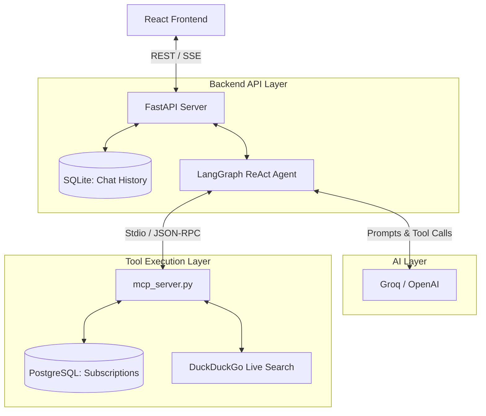

# System Architecture: Demo 6C (Agentic Chatbot)

This document outlines the high-level architecture of the Subscription Assistant. The system follows a **decoupled Agentic Architecture** consisting of a React frontend, a FastAPI routing layer, a LangGraph orchestrator, and an independent Model Context Protocol (MCP) tool server.

## Architectural Diagram (Conceptual)

## Component Breakdown

### 1. Frontend (React / Vite)
- **Role:** Handles user input and displays markdown-rendered AI responses.
- **Key Features:**
  - `App.jsx` handles state and sidebar navigation.
  - Streaming responses using Server-Sent Events (SSE) via the Fetch API.
  - Generates unique `session_id`s stored in `localStorage` to manage multi-turn chat threads.

### 2. API Gateway (FastAPI - `main.py`)
- **Role:** The entry point for the frontend to communicate with the Python backend.
- **Endpoints:**
  - `POST /api/chat`: Streams the agent's responses.
  - `GET /api/chat/history/{session_id}`: Retrieves previous chat transcripts.
- **Responsibilities:** Translates HTTP requests into Agent invocations.

### 3. Agent Orchestrator (LangGraph - `mcp_graph.py`)
- **Role:** The brain of the system.
- **Workflow:**
  1. Receives the user's input and session history (fetched dynamically using `SQLChatMessageHistory`).
  2. Bootstraps the `mcp_server.py` via `mcp.ClientSession`.
  3. Uses `langgraph.prebuilt.create_react_agent` to wrap the LLM.
  4. Initiates the **ReAct (Reason + Act)** loop. The LLM decides what tools to call; LangGraph pauses, executes the tool, and feeds the observation back to the LLM until the goal is achieved.

### 4. Tool Registry (MCP Server - `mcp_server.py`)
- **Role:** Secure, decoupled execution environment for tools.
- **Tools Provided:**
  - **Database CRUD:** `get_subscriptions`, `create_subscription`, `delete_subscription` interact safely with PostgreSQL using SQLAlchemy.
  - **Logic & Mock Data:** `get_alternative_plans`, `get_usage_statistics`.
  - **Web Scraping:** `search_public_subscription_data` uses `ddgs` to perform real-time internet lookups.
- **Why MCP?** The agent doesn't need to know *how* to connect to PostgreSQL. It simply asks the MCP server to execute a function by name, and the MCP server returns a JSON string.

## Data Flow Example: "Save me money"
1. **User** types: *"Review my subscriptions to save money"*
2. **FastAPI** receives the request and passes it to **LangGraph**.
3. **LangGraph** sends the prompt to the **LLM**.
4. **LLM** says: *"I need to see their subscriptions first. Call `get_subscriptions`."*
5. **LangGraph** intercepts the tool call and sends a JSON-RPC request to **mcp_server.py**.
6. **mcp_server.py** queries PostgreSQL and returns the user's data.
7. **LLM** sees a $15 Netflix plan and says: *"Call `search_public_subscription_data` to find a cheaper Netflix plan."*
8. **mcp_server.py** executes a DuckDuckGo web search, formats the results, and returns them.
9. **LLM** synthesizes the final answer: *"You have Netflix for $15. I searched the web and found an ad-supported plan for $6. Switch to save $9!"*
10. **FastAPI** streams this text back to the **React** UI.
